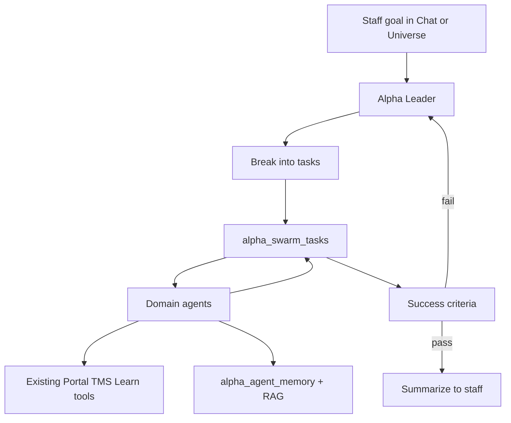

# Alpha Swarm Architecture (ClawTeam × Ruflo style)

Target for **Alpha AI** (`ai.alphasolutions.software`): a staff-gated multi-agent harness — not a fork of [ClawTeam](https://github.com/HKUDS/ClawTeam) or [Ruflo](https://github.com/ruvnet/ruflo), but the same ideas adapted to Alpha’s products and security rules.

## Principles (locked)

- **Staff-only** for swarm / tools / memory writes (same allowlist as Jarvis).
- **Public Support Agent** stays separate (no staff tools, origin + site key).
- **Structured data** everywhere (`site_slug`, `product`, roles, timestamps).
- **Simplicity** (Karpathy): ship a thin harness first; no 300-tool clone.

## Mapping

| Concept | ClawTeam / Ruflo | Alpha v1 |
|---------|------------------|----------|
| Leader | Leader agent spawns workers | Alpha Star (`/api/alpha` + chat) plans and delegates |
| Workers | Specialized agents in worktrees | Domain agents: Dispatch, Portal, Learn, Support, Knowledge, Ops |
| Board | Task list + inbox | Supabase `alpha_swarm_tasks` + `alpha_swarm_events` |
| Memory | AgentDB / RAG plugins | Existing `alpha_chunks` + new `alpha_agent_memory` (session/goal scoped) |
| Verify loop | Tests / board status | Goal criteria JSON + optional script/security checks |
| UI | tmux / web board | Universe galaxy + `/swarm` task board (staff) |

## Data model (new tables)

```
alpha_swarm_runs     — id, staff_user_id, goal, status, plan jsonb, created_at
alpha_swarm_tasks    — id, run_id, agent_id, title, status, blocked_by[], result jsonb
alpha_swarm_events   — id, run_id, task_id?, role, content, meta jsonb
alpha_agent_memory   — id, agent_id, scope, key, content, embedding?, site_slug?, product?
```

RLS: staff only via service role in AI APIs (same pattern as `support_*`).

## Runtime flow



1. Staff states a goal (“summarize open AFN support + overdue TMS loads”).
2. Leader writes a short plan + tasks with `agent_id` and verify steps.
3. Workers run sequentially or lightly parallel (v1: sequential to avoid write races).
4. Each task stores result; leader merges a final answer.
5. Writes still go through **confirm** gate.

## API surface (AI app)

- `POST /api/swarm/runs` — create run from goal
- `GET /api/swarm/runs/[id]` — board + events
- `POST /api/swarm/runs/[id]/tick` — advance next ready task (or cron)
- Reuse `/api/chat` tools inside worker context with `agent_id` in audit

## UI

- Keep professional Staff Console shell.
- Universe: satellites = workers; selecting a planet shows that agent’s queue.
- New `/swarm` page: run list + task board (Kanban: queued / running / done / blocked).

## Phases

1. **Schema + board UI** — tasks/events, no auto-spawn yet  
2. **Leader planner** — Groq returns structured task graph (Zod)  
3. **Worker loop** — one agent per tick, tool access by agent allowlist  
4. **Memory** — store successful patterns per `agent_id`  
5. **Optional** — deeper Ruflo-like plugins only if a clear Alpha product need exists  

## Non-goals (v1)

- Git worktrees / tmux (ClawTeam coding swarm)  
- Installing full Ruflo into the Next app  
- Opening swarm APIs to public sites  

## Success criteria

- Staff can create a multi-step run from chat or `/swarm`  
- At least Dispatch + Support + Knowledge workers execute real tools  
- All writes confirmed; no anon access  
- Board shows live status without glass/HUD clutter  
